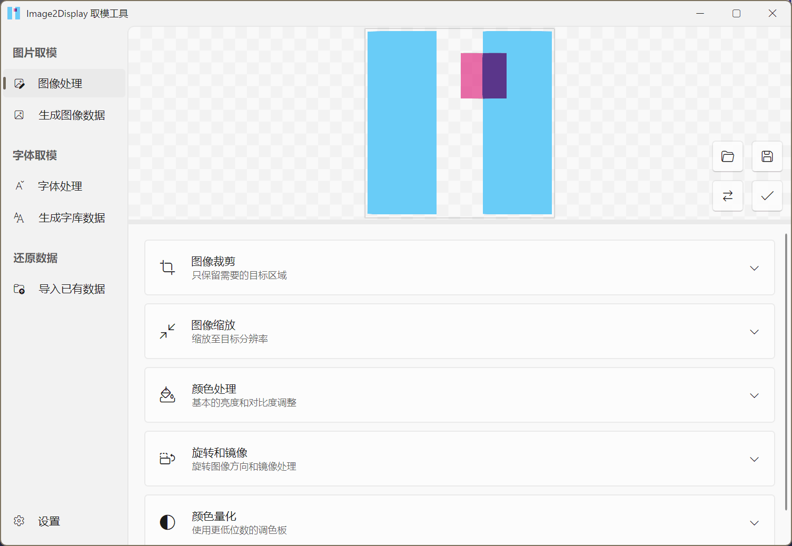
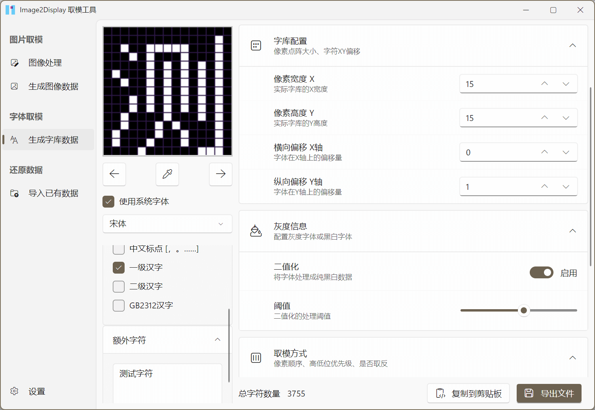

# Image2display

中文 | [English](./README_EN.md)

     
    
     

    
    
    
    

跨平台的图片与字体数据处理工具，用于生成单片机可用的数据。基本目标为替代image2lcd与PCtoLCD

支持Win10+、linux、OSX

| 图片取模 | 字体取模 |
|--------|--------|
|  |  |

## 下载

所有正式版本：[GitHub Releases](https://github.com/chenxuuu/image2display/releases/latest)

CI快照版：[GitHub Action](https://nightly.link/chenxuuu/image2display/workflows/build/master)

## 功能

- 图片预处理
  - 提前裁剪、缩放、旋转图片
  - 修改图片的亮度、对比度、饱和度、替换透明背景色
  - 二值化图片，支持自定义阈值、抖动算法
  - 量化颜色，减少调色板颜色数量，支持自定义量化颜色抖动算法
- 图片取模导出
  - 自定义取模方式，支持调色板与RGB565、RGB888、ARGB8888等格式
  - 自定义遍历方式，支持从左到右、从上到下、从右到左、从下到上等方式
  - 导出数据的字节序，支持大端、小端
  - 颜色内部的位序，支持倒序
  - 支持导出为C语言数组、Bin文件
- 字体取模
  - 使用系统字体或者TTF/OTF字体
  - 支持自定义字体大小、字体样式、偏移、字体灰度、反色
  - 预置常用字符集，支持自定义字符
  - 可配置字节顺序、位序
  - 实时预览当前的处理效果
  - 支持导出为C语言数组、复制到剪贴板
