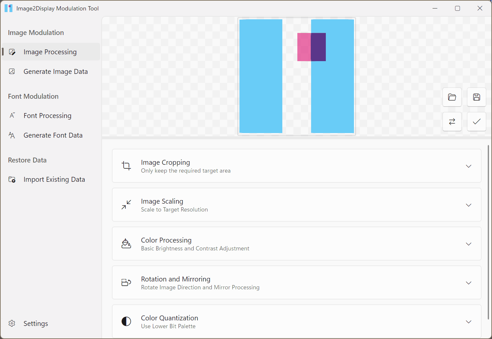

# (WIP)Image2display

[Chinese](./README.md) | English

     
    
     

    
    
    
    

A cross-platform image and font data processing tool for generating data usable by microcontrollers.

Supports Win10+, Linux, OSX

## Download

All official versions: [GitHub Releases](https://github.com/chenxuuu/image2display/releases/latest)

CI snapshot version: [GitHub Action](https://nightly.link/chenxuuu/image2display/workflows/build/master)

## Features

- Image Preprocessing
  - Pre-crop, scale, and rotate images
  - Adjust image brightness, contrast, saturation, and replace transparent backgrounds
  - Binarize images with customizable thresholds and dithering algorithms
  - Quantize colors to reduce the number of palette colors, with support for custom color quantization dithering algorithms
- Image Modulation Export
  - Customize modulation methods, supporting palette and formats like RGB565, RGB888, ARGB8888, etc.
  - Customize traversal methods, supporting left-to-right, top-to-bottom, right-to-left, bottom-to-top, etc.
  - Export data endianness, supporting big-endian and little-endian
  - Bit order within colors, supporting reverse order
  - Support export as C language arrays and Bin files
- Font Processing
  - TBD
- Font Modulation Export
  - TBD
